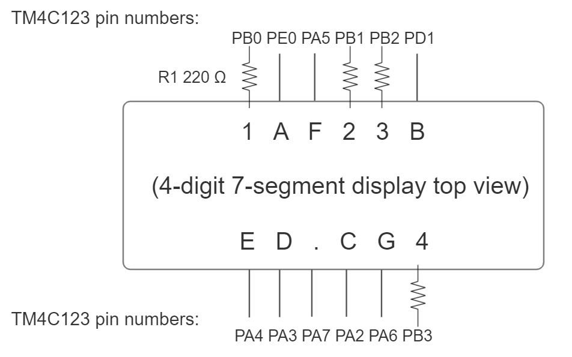
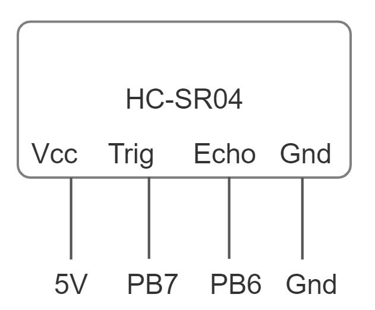

# Sonic Ruler
This code drives an HC-SR04 ultrasonic distance sensor and displays the measured distance (mm) on a 4-digit, 7-segment display. It is built with the GNU toolchain in Code Composer Studio.

Credit for `startup_tm4c_gnu.c`, `TM4C123GH6PM.h`, and `tm4c123gh6pm.lds` goes to Quantum Leaps' Modern Embedded Systems Programming Video Course.

## Schematics
### Common cathode 4-digit 7-segment display pin connections:

  

Note that the above circuit assumes that only one digit is active at a time, i.e. that only one of pins 1, 2, 3, and 4 are low at one time. Multiple active digits may burn the circuit.

### HC-SR04 ultrasonic distance sensor pin connections:

  

Note that the TM4C123 MCU has no 5V output, so the HC-SR04 requires an additional power source.
